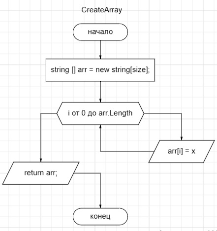

# Описание решения итогового задания
Данное задание разделили на 5 методов
## Первый метод 
Создаем метод который позволяет исключить неправильный ввод от пользователя.

1. Пользователь вводит целое неотрицательное число.
2. Идет проверка на то, что пользователь ввел действительно положительно число больше 0, а не слово, символ или отрицательное число. Если проверка не прошла, то пользователя возвращают в начало метода, сообщают об ошибке ввода и прелогают повторный ввод.
3. Если проверка прошла, то возвращаем длину массива введенную пользователем.

## Второй метод метод
В данном методе создаем массив длиной раннее введенной пользователем, который будет заполнять сам пользователь.
 

1. Создаем массив с длинной заданной пользователем.
2. С помощью цикла происходит запрос пользователя на заполнение массива строками. Пользователь вводит данные до тех пор пока массив не заполниться (ограничен длянной заданной пользователем).
3. После заполнения массива возвращаем заполненый массив.