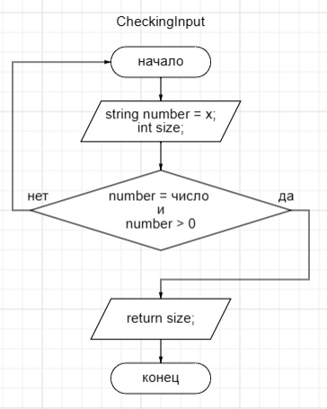

# Описание решения итогового задания
Данное задание разделили на 5 методов
## Первый метод 
Создаем метод который позволяет исключить неправильный ввод от пользователя.

1. Пользователь вводит целое неотрицательное число.
2. Идет проверка на то, что пользователь ввел действительно положительно число больше 0, а не слово, символ или отрицательное число. Если проверка не прошла, то пользователя возвращают в начало метода, сообщают об ошибке ввода и прелогают повторный ввод.
3. Если проверка прошла, то возвращаем длину массива введенную пользователем.

## Второй метод метод
В данном методе создаем массив длиной раннее введенной пользователем, который будет заполнять сам пользователь.

 

1. Создаем массив с длинной заданной пользователем.
2. С помощью цикла происходит запрос пользователя на заполнение массива строками. Пользователь вводит данные до тех пор пока массив не заполниться (ограничен длянной заданной пользователем).
3. После заполнения массива возвращаем заполненый массив.

## Третий метод
Данный метод для определения размера будущего массива, где буду содержаться строковые элементы длина которых меньше либо равна 3 символам.

1. На вход приходит заполненый пользователем массив. Для определения нового размера массива введен размер равный нулю (счетчк).
2. Далее через цикл прогоняем элементы массива.
3. Если длина элемента массива меннее либо равно 3 счетчик увеличивается на 1.
4. По прекращению цикла возвращается наш новый будущий размер массива (счетчик).

## Четвертый метод
В данном методе создается новый массив с элементами меньше либо равно 3.

1. На вход приходит массив созданный пользователем, размер нового массива. Создается новый массив с найденным размером.
2. Далее по циклу идет заполнение нового массива.
3. В цикле идет проверка на длину элемента. Если длина элемента меньше либо равна 3, то данный элемент записывается в новый массив. Если проверка не прошла, то возвращаемся обратно к циклу, до тех пор пока массив польностью не заполниться.
4. После заполнения возвращаем созданный массив.

## Пятый метод
Данный метод предназначен для выведения нашего результата пользователю.

1. На вход приходит массив, которые необходимо вывести пользователю.
2. Через цикл выводиться массив с элементами.

>В данном случае мы вывели массив введеный пользователем и новый созданный массив. (Вывели два для сравнения).